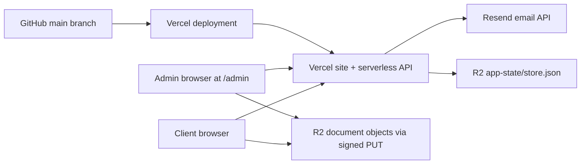

# Infrastructure Notes

Last reviewed: 2026-05-26

This project is a small client upload portal for Lev's Income Tax. It uses GitHub for source control, Vercel for hosting and serverless execution, Resend for outbound email, and Cloudflare R2 for private document storage plus application state.

## System Map

## Repository And Deployment

- GitHub remote: `https://github.com/samperet/LevsIncomeTax.git`
- Primary branch: `main`
- Vercel deployment is expected to be connected to the GitHub repo. Verify this in the Vercel project settings if deployments stop following `main`.
- The app has no build step. `index.html` is the frontend, `server.js` is the Express backend, and `api/index.js` exports the Express app for Vercel.
- Local command: `npm run dev`, which starts `server.js` on `PORT` or `4173`.
- Verification command: `npm run check`, which syntax-checks `server.js` and `service-worker.js`.
- There is currently no `.github/workflows` CI. Checks are manual unless Vercel is configured to run them.

Source-of-truth files:

- `server.js`: Express API, email sending, R2 client, state persistence
- `index.html`: public UI and admin dashboard
- `api/index.js`: Vercel serverless entry point
- `vercel.json`: Vercel route rewrites
- `service-worker.js`: offline/cache behavior
- `site.webmanifest`: installable app metadata
- `.env.example`: local/deployment configuration template

## Vercel

Vercel serves the public app and the admin dashboard.

- `/api/*` is rewritten to `/api/index`, which loads `server.js`.
- `/admin` and `/admin/` are rewritten to `/index.html`, preserving `/admin` in the browser so the dashboard is bookmarkable.
- Vercel sets `Cache-Control: no-store` on `/admin` and `/admin/` to avoid stale cached admin routing behavior.
- Static assets are root-relative, which matters because the same app is served from `/` and `/admin`.
- The service worker precaches static shell assets and uses network-first behavior for HTML/navigation requests. This is important for `/admin`, because stale cached admin HTML can otherwise look like a redirect loop. When changing frontend routing behavior, bump `CACHE_NAME` in `service-worker.js` so installed/mobile clients receive the new version.

Production Vercel environment variables should include:

| Variable | Purpose |
|---|---|
| `ADMIN_PASSWORD` | Admin dashboard password. Must be strong in production. |
| `ADMIN_EMAIL` | Receives upload notification emails. |
| `EMAIL_FROM` | Sender address on the verified Resend domain. |
| `RESEND_API_KEY` | Sends magic links and upload notifications. |
| `PUBLIC_APP_URL` | Public production URL used to build magic links. |
| `R2_ACCOUNT_ID` | Cloudflare account ID for R2 S3 endpoint. |
| `R2_ACCESS_KEY_ID` | R2 S3 API access key. |
| `R2_SECRET_ACCESS_KEY` | R2 S3 API secret. |
| `R2_BUCKET` | Bucket for documents and app state. |
| `STORE_R2_KEY` | Optional path for the JSON state object. Defaults to `app-state/store.json`. |

## Resend

Resend is used by `sendEmail()` in `server.js`.

Email flows:

- Client enters email in the portal.
- `POST /api/magic-link` creates a single-use magic link and sends it through Resend.
- Successful upload triggers an admin notification email.

Important details:

- `EMAIL_FROM` must use a sender on a Resend-verified domain. Do not use `onboarding@resend.dev` for real clients.
- If `RESEND_API_KEY` is absent, or `EMAIL_MODE=console`, emails are printed to server logs for local testing.
- Magic links expire after 15 minutes and are stored as token hashes, not raw tokens.

## Cloudflare R2

R2 is used for two separate concerns in the same bucket:

- Document objects: `clients/{clientId}/{timestamp}-{uuid}-{sanitizedFileName}`
- Application state: `app-state/store.json` unless `STORE_R2_KEY` overrides it

Document upload flow:

1. Authenticated client asks `POST /api/uploads/presign` for signed PUT URLs.
2. Browser uploads files directly to R2. The Node server never receives file bytes.
3. Browser submits metadata to `POST /api/uploads`.
4. Server records private R2 object keys in the JSON store.

Document download/preview flow:

1. Admin dashboard asks `POST /api/admin/documents/download` with a stored object key.
2. Server verifies the admin session and confirms the key exists in a client record.
3. Server returns a short-lived signed GET URL.
4. The dashboard opens that URL for preview or download.

R2 bucket CORS must allow the production origin and local development origin for browser uploads. Keep allowed methods to `PUT` and `GET`, and allowed headers to what the app sends, currently `Content-Type`.

`R2_PUBLIC_BASE_URL` exists in `.env.example`, but the current server does not use it. Admin preview and download use signed GET URLs instead of public bucket URLs.

## Application State Model

The backend is intentionally stateless from Vercel's point of view. Persistent state is a single JSON object stored in R2:

- `clients`
- `magicLinks`
- `clientSessions`
- `adminSessions`
- `alerts`

If R2 credentials are missing, local development falls back to `data/store.json`. In that mode, document uploads cannot work because there is no object storage target for signed uploads.

Known limitation: the JSON store is not transaction-safe across multiple Vercel instances. `writeQueue` serializes writes only inside one running Node process. Two concurrent serverless invocations can still read the same R2 state and overwrite each other. This is acceptable only while traffic is low.

## Security Model

Current protections:

- Client sign-in uses short-lived, single-use magic links.
- Session tokens and magic link tokens are stored as SHA-256 hashes in server state.
- Admin routes require an admin bearer token created after password login.
- Uploaded documents stay in private R2 object storage.
- Document access uses short-lived signed URLs.
- Admin document download checks that the requested object key exists in stored client metadata.
- Client upload keys include client ID, timestamp, UUID, and sanitized filename.

Current tradeoffs:

- Admin authentication is one shared password, not individual admin accounts.
- Browser sessions use `sessionStorage`, not HttpOnly cookies.
- There is no rate limiting on login, magic-link requests, or presign requests.
- There is no malware scanning or content inspection on uploaded files.
- There is no audit log for admin preview/download/edit actions.
- There is no automated backup or restore workflow documented for `app-state/store.json`.

## Operational Checklist

Before production use:

- Confirm Vercel production env vars are set and not only local `.env`.
- Confirm `PUBLIC_APP_URL` is the real production URL.
- Confirm Resend domain verification is complete.
- Confirm `EMAIL_FROM` is on that verified domain.
- Confirm R2 CORS includes production URL and `http://localhost:4173`.
- Confirm `/admin` returns the dashboard directly and does not redirect to `/index.html?admin=1`.
- Confirm a test client can receive a magic link, upload a small PDF, and that the admin can preview/download it.
- Confirm `service-worker.js` cache version was bumped after frontend changes.

When rotating secrets:

- Rotate Vercel env vars first.
- Redeploy Vercel after env changes.
- Rotate R2 API keys in Cloudflare.
- Rotate Resend API key in Resend.
- Update local `.env` only on trusted machines.
- Never commit `.env`, local `data/`, or exported store files.

## Improvement Recommendations

Highest priority:

1. Add GitHub Actions CI.
   Run `npm ci`, `npm run check`, JSON parsing, and a basic smoke test for `/admin` and `/api/health` on every push and pull request.

2. Move state from a single R2 JSON blob to a transactional data store.
   Good next options are Vercel Postgres, Neon/Supabase Postgres, or Cloudflare D1. This removes the concurrent-write risk and makes client/document/admin audit queries easier.

3. Add rate limiting.
   Protect `/api/magic-link`, `/api/admin/login`, `/api/uploads/presign`, and admin document signing. Use IP plus email/client ID where possible.

4. Replace the shared admin password with individual admin accounts or an identity provider.
   At minimum, use stronger password handling and add lockout/backoff. Better: use Vercel/Cloudflare Access, Auth0, Clerk, or another identity layer with MFA.

5. Add backups for app state.
   Until state moves to a database, snapshot `app-state/store.json` on a schedule and keep dated copies in a separate R2 prefix or bucket.

Important next steps:

6. Add admin audit logging.
   Record admin login, tax info edits, document previews/downloads, magic-link sends, and alert state changes.

7. Add upload scanning or a quarantine workflow.
   Tax documents are sensitive and can contain unsafe file payloads. Consider malware scanning before admin download/preview.

8. Improve service worker update behavior.
   The current cache-first strategy can keep stale HTML around until the cache name changes. A network-first strategy for HTML would reduce surprise during deployments.

9. Split R2 concerns.
   Consider separate buckets or at least separate credentials/prefixes for app state and client documents. This limits blast radius if a key is misused.

10. Add structured monitoring.
   Capture API errors, Resend failures, R2 failures, upload failures, and Vercel function errors in a dashboard or alerting tool.

11. Add deployment environment parity.
   Keep Vercel Preview env vars configured against a non-production R2 bucket/prefix and Resend test sender, so changes can be tested without touching real client data.

12. Document restore drills.
   Practice restoring the JSON store or future database from backup before tax-season traffic depends on it.

Nice to have:

13. Add a small `/api/version` endpoint.
   Return git SHA, deployment time, and environment name to simplify debugging.

14. Add file-type validation beyond MIME prefix.
   Browser-provided MIME values can be wrong. Consider validating file signatures after upload if scanning is added.

15. Add client/admin session revocation tools.
   Useful if a magic link is sent to the wrong address or a device is lost.

16. Move large inline frontend code into versioned JS/CSS assets.
   This would make caching, reviews, and targeted browser tests easier as the dashboard grows.
